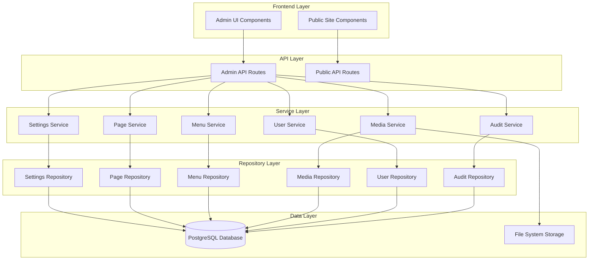

# Design Document

## Overview

This design document outlines the architecture and implementation approach for transforming the existing admin panel into a comprehensive Content Management System (CMS). The enhancement will add site settings management, custom page creation, navigation/footer control, media library, user roles, audit logging, and bulk operations while maintaining the existing Next.js 14 App Router architecture and Prisma ORM integration.

The design follows the established layered architecture pattern (Route Handlers → Services → Repositories → Prisma) and integrates seamlessly with the existing authentication, caching, and validation systems.

## Architecture

### High-Level Architecture



### System Components

1. **Admin UI Layer**: React components for admin interface using shadcn/ui
2. **API Routes**: Next.js App Router endpoints for CRUD operations
3. **Service Layer**: Business logic for each CMS feature
4. **Repository Layer**: Data access abstraction using Prisma
5. **Database**: PostgreSQL with extended schema for CMS features
6. **File Storage**: Public uploads directory for media files

## Components and Interfaces

### Database Schema Extensions

New Prisma models to support CMS features:

```prisma
// Site-wide settings
model SiteSettings {
  id              String   @id @default(cuid())
  siteName        String   @default("Q&A Article FAQ")
  logoUrl         String?
  faviconUrl      String?
  seoTitle        String?
  seoDescription  String?
  seoKeywords     String[]
  socialLinks     Json?    // {twitter, facebook, linkedin, etc.}
  customCss       String?  @db.Text
  customJs        String?  @db.Text
  updatedAt       DateTime @updatedAt
  updatedBy       String?
}

// Custom pages (About, Contact, etc.)
model Page {
  id              String        @id @default(cuid())
  slug            String        @unique
  title           String
  content         String        @db.Text
  status          ContentStatus @default(DRAFT)
  seoTitle        String?
  seoDescription  String?
  seoKeywords     String[]
  createdAt       DateTime      @default(now())
  updatedAt       DateTime      @updatedAt
  createdBy       String?
  updatedBy       String?
  
  @@index([slug])
  @@index([status])
}

// Navigation menu items
model MenuItem {
  id          String      @id @default(cuid())
  label       String
  url         String
  order       Int
  parentId    String?
  isExternal  Boolean     @default(false)
  openNewTab  Boolean     @default(false)
  createdAt   DateTime    @default(now())
  updatedAt   DateTime    @updatedAt
  
  parent      MenuItem?   @relation("MenuHierarchy", fields: [parentId], references: [id], onDelete: Cascade)
  children    MenuItem[]  @relation("MenuHierarchy")
  
  @@index([order])
  @@index([parentId])
}

// Footer configuration
model FooterColumn {
  id        String       @id @default(cuid())
  title     String
  order     Int
  createdAt DateTime     @default(now())
  updatedAt DateTime     @updatedAt
  
  links     FooterLink[]
  
  @@index([order])
}

model FooterLink {
  id        String       @id @default(cuid())
  columnId  String
  label     String
  url       String
  order     Int
  createdAt DateTime     @default(now())
  updatedAt DateTime     @updatedAt
  
  column    FooterColumn @relation(fields: [columnId], references: [id], onDelete: Cascade)
  
  @@index([columnId, order])
}

model FooterSettings {
  id            String   @id @default(cuid())
  copyrightText String
  socialLinks   Json?    // {twitter, facebook, linkedin, etc.}
  updatedAt     DateTime @updatedAt
}

// Media library
model Media {
  id          String   @id @default(cuid())
  filename    String
  originalName String
  mimeType    String
  size        Int      // in bytes
  url         String
  thumbnailUrl String?
  uploadedBy  String?
  createdAt   DateTime @default(now())
  
  @@index([mimeType])
  @@index([createdAt])
}

// User management with roles
enum UserRole {
  ADMIN
  EDITOR
  VIEWER
}

model User {
  id        String    @id @default(cuid())
  email     String    @unique
  password  String    // hashed
  name      String
  role      UserRole  @default(VIEWER)
  isActive  Boolean   @default(true)
  createdAt DateTime  @default(now())
  updatedAt DateTime  @updatedAt
  
  auditLogs AuditLog[]
  
  @@index([email])
  @@index([role])
}

// Audit logging
enum AuditAction {
  CREATE
  UPDATE
  DELETE
  LOGIN
  LOGOUT
}

model AuditLog {
  id          String      @id @default(cuid())
  userId      String
  action      AuditAction
  entityType  String      // "Topic", "Page", "Settings", etc.
  entityId    String?
  details     Json?       // before/after values
  ipAddress   String?
  userAgent   String?
  createdAt   DateTime    @default(now())
  
  user        User        @relation(fields: [userId], references: [id], onDelete: Cascade)
  
  @@index([userId])
  @@index([entityType])
  @@index([createdAt])
}
```


### API Endpoints

#### Settings Management
- `GET /api/admin/settings` - Get current site settings
- `PUT /api/admin/settings` - Update site settings
- `POST /api/admin/settings/logo` - Upload logo image

#### Page Management
- `GET /api/admin/pages` - List all pages (with pagination)
- `GET /api/admin/pages/[slug]` - Get page by slug
- `POST /api/admin/pages` - Create new page
- `PUT /api/admin/pages/[slug]` - Update page
- `DELETE /api/admin/pages/[slug]` - Delete page

#### Menu Management
- `GET /api/admin/menus` - Get menu structure
- `POST /api/admin/menus` - Create menu item
- `PUT /api/admin/menus/[id]` - Update menu item
- `DELETE /api/admin/menus/[id]` - Delete menu item
- `PUT /api/admin/menus/reorder` - Reorder menu items

#### Footer Management
- `GET /api/admin/footer` - Get footer configuration
- `PUT /api/admin/footer/settings` - Update footer settings
- `POST /api/admin/footer/columns` - Create footer column
- `PUT /api/admin/footer/columns/[id]` - Update footer column
- `DELETE /api/admin/footer/columns/[id]` - Delete footer column
- `POST /api/admin/footer/links` - Create footer link
- `PUT /api/admin/footer/links/[id]` - Update footer link
- `DELETE /api/admin/footer/links/[id]` - Delete footer link

#### Media Management
- `GET /api/admin/media` - List all media files
- `POST /api/admin/media/upload` - Upload file
- `DELETE /api/admin/media/[id]` - Delete file

#### User Management
- `GET /api/admin/users` - List all users
- `POST /api/admin/users` - Create user
- `PUT /api/admin/users/[id]` - Update user
- `DELETE /api/admin/users/[id]` - Delete user

#### Audit Log
- `GET /api/admin/audit-log` - Get audit logs (with filters)
- `GET /api/admin/audit-log/export` - Export audit log as CSV

#### Cache Management
- `GET /api/admin/cache/stats` - Get cache statistics
- `POST /api/admin/cache/clear` - Clear cache (all or specific tags)

#### Bulk Operations
- `POST /api/admin/topics/bulk-delete` - Delete multiple topics
- `POST /api/admin/topics/bulk-update` - Update multiple topics
- `POST /api/admin/topics/export` - Export topics as JSON
- `POST /api/admin/topics/import` - Import topics from JSON


### Service Layer Interfaces

```typescript
// Settings Service
interface SettingsService {
  getSettings(): Promise<SiteSettings>;
  updateSettings(data: UpdateSettingsInput): Promise<SiteSettings>;
  uploadLogo(file: File): Promise<string>; // returns URL
}

// Page Service
interface PageService {
  listPages(filters: PageFilters): Promise<PaginatedPages>;
  getPageBySlug(slug: string): Promise<Page | null>;
  createPage(data: CreatePageInput): Promise<Page>;
  updatePage(slug: string, data: UpdatePageInput): Promise<Page>;
  deletePage(slug: string): Promise<void>;
}

// Menu Service
interface MenuService {
  getMenuStructure(): Promise<MenuItem[]>;
  createMenuItem(data: CreateMenuItemInput): Promise<MenuItem>;
  updateMenuItem(id: string, data: UpdateMenuItemInput): Promise<MenuItem>;
  deleteMenuItem(id: string): Promise<void>;
  reorderMenuItems(items: ReorderInput[]): Promise<void>;
}

// Footer Service
interface FooterService {
  getFooterConfig(): Promise<FooterConfig>;
  updateFooterSettings(data: UpdateFooterSettingsInput): Promise<FooterSettings>;
  createColumn(data: CreateColumnInput): Promise<FooterColumn>;
  updateColumn(id: string, data: UpdateColumnInput): Promise<FooterColumn>;
  deleteColumn(id: string): Promise<void>;
  createLink(data: CreateLinkInput): Promise<FooterLink>;
  updateLink(id: string, data: UpdateLinkInput): Promise<FooterLink>;
  deleteLink(id: string): Promise<void>;
}

// Media Service
interface MediaService {
  listMedia(filters: MediaFilters): Promise<PaginatedMedia>;
  uploadFile(file: File, userId: string): Promise<Media>;
  deleteFile(id: string): Promise<void>;
  generateThumbnail(filePath: string): Promise<string>;
}

// User Service
interface UserService {
  listUsers(): Promise<User[]>;
  createUser(data: CreateUserInput): Promise<User>;
  updateUser(id: string, data: UpdateUserInput): Promise<User>;
  deleteUser(id: string): Promise<void>;
  authenticateUser(email: string, password: string): Promise<User | null>;
}

// Audit Service
interface AuditService {
  logAction(data: AuditLogInput): Promise<void>;
  getAuditLogs(filters: AuditFilters): Promise<PaginatedAuditLogs>;
  exportAuditLog(filters: AuditFilters): Promise<string>; // returns CSV
}
```


### Admin UI Components

```
src/components/admin/
├── layout/
│   ├── AdminSidebar.tsx          # Navigation sidebar
│   ├── AdminHeader.tsx           # Top header with user menu
│   └── AdminBreadcrumbs.tsx      # Breadcrumb navigation
├── settings/
│   ├── SettingsForm.tsx          # Site settings form
│   ├── LogoUploader.tsx          # Logo upload component
│   └── SeoSettingsForm.tsx       # SEO metadata form
├── pages/
│   ├── PageList.tsx              # Pages table
│   ├── PageForm.tsx              # Create/edit page form
│   └── PageEditor.tsx            # Rich text editor wrapper
├── menus/
│   ├── MenuBuilder.tsx           # Drag-and-drop menu builder
│   ├── MenuItemForm.tsx          # Menu item form
│   └── MenuPreview.tsx           # Menu preview
├── footer/
│   ├── FooterBuilder.tsx         # Footer configuration UI
│   ├── FooterColumnForm.tsx      # Column form
│   └── FooterLinkForm.tsx        # Link form
├── media/
│   ├── MediaLibrary.tsx          # Media grid view
│   ├── MediaUploader.tsx         # File upload component
│   └── MediaDetails.tsx          # File details modal
├── users/
│   ├── UserList.tsx              # Users table
│   ├── UserForm.tsx              # Create/edit user form
│   └── RoleSelector.tsx          # Role dropdown
├── audit/
│   ├── AuditLogTable.tsx         # Audit log table
│   ├── AuditFilters.tsx          # Filter controls
│   └── AuditDetails.tsx          # Log entry details
├── cache/
│   ├── CacheStats.tsx            # Cache statistics
│   └── CacheControls.tsx         # Clear cache buttons
└── bulk/
    ├── BulkSelector.tsx          # Checkbox selection
    ├── BulkActions.tsx           # Bulk action dropdown
    └── BulkProgress.tsx          # Progress indicator
```

### Public Site Components

```
src/components/public/
├── layout/
│   ├── Header.tsx                # Dynamic header with menu
│   ├── Footer.tsx                # Dynamic footer
│   └── Navigation.tsx            # Navigation menu
└── pages/
    └── CustomPage.tsx            # Custom page renderer
```


## Data Models

### Validation Schemas (Zod)

```typescript
// Settings validation
const SiteSettingsSchema = z.object({
  siteName: z.string().min(1).max(100),
  logoUrl: z.string().url().optional(),
  faviconUrl: z.string().url().optional(),
  seoTitle: z.string().max(60).optional(),
  seoDescription: z.string().max(160).optional(),
  seoKeywords: z.array(z.string()).optional(),
  socialLinks: z.record(z.string().url()).optional(),
  customCss: z.string().optional(),
  customJs: z.string().optional(),
});

// Page validation
const PageSchema = z.object({
  slug: z.string().regex(/^[a-z0-9-]+$/),
  title: z.string().min(1).max(200),
  content: z.string().min(1),
  status: z.enum(['DRAFT', 'PUBLISHED']),
  seoTitle: z.string().max(60).optional(),
  seoDescription: z.string().max(160).optional(),
  seoKeywords: z.array(z.string()).optional(),
});

// Menu item validation
const MenuItemSchema = z.object({
  label: z.string().min(1).max(50),
  url: z.string().min(1),
  order: z.number().int().min(0),
  parentId: z.string().optional(),
  isExternal: z.boolean().default(false),
  openNewTab: z.boolean().default(false),
});

// Footer validation
const FooterColumnSchema = z.object({
  title: z.string().min(1).max(50),
  order: z.number().int().min(0),
});

const FooterLinkSchema = z.object({
  columnId: z.string(),
  label: z.string().min(1).max(50),
  url: z.string().min(1),
  order: z.number().int().min(0),
});

// User validation
const UserSchema = z.object({
  email: z.string().email(),
  password: z.string().min(8),
  name: z.string().min(1).max(100),
  role: z.enum(['ADMIN', 'EDITOR', 'VIEWER']),
  isActive: z.boolean().default(true),
});

// Media validation
const MediaUploadSchema = z.object({
  file: z.instanceof(File),
  maxSize: z.number().default(10 * 1024 * 1024), // 10MB
  allowedTypes: z.array(z.string()).default([
    'image/jpeg',
    'image/png',
    'image/gif',
    'image/webp',
    'application/pdf',
  ]),
});
```


## Error Handling

### Error Types

```typescript
class CMSError extends Error {
  constructor(
    message: string,
    public code: string,
    public statusCode: number = 500
  ) {
    super(message);
    this.name = 'CMSError';
  }
}

// Specific error classes
class ValidationError extends CMSError {
  constructor(message: string) {
    super(message, 'VALIDATION_ERROR', 400);
  }
}

class NotFoundError extends CMSError {
  constructor(resource: string) {
    super(`${resource} not found`, 'NOT_FOUND', 404);
  }
}

class UnauthorizedError extends CMSError {
  constructor(message: string = 'Unauthorized') {
    super(message, 'UNAUTHORIZED', 401);
  }
}

class ForbiddenError extends CMSError {
  constructor(message: string = 'Forbidden') {
    super(message, 'FORBIDDEN', 403);
  }
}

class DuplicateError extends CMSError {
  constructor(resource: string) {
    super(`${resource} already exists`, 'DUPLICATE', 409);
  }
}
```

### Error Handling Strategy

1. **API Routes**: Catch all errors and return appropriate HTTP status codes
2. **Service Layer**: Throw specific error types for different scenarios
3. **Repository Layer**: Let Prisma errors bubble up, catch in service layer
4. **Frontend**: Display user-friendly error messages using toast notifications
5. **Audit Logging**: Log all errors with context for debugging

### Example Error Handler

```typescript
export async function handleAPIError(error: unknown): Promise<Response> {
  if (error instanceof CMSError) {
    return Response.json(
      { error: error.message, code: error.code },
      { status: error.statusCode }
    );
  }
  
  if (error instanceof z.ZodError) {
    return Response.json(
      { error: 'Validation failed', details: error.errors },
      { status: 400 }
    );
  }
  
  console.error('Unexpected error:', error);
  return Response.json(
    { error: 'Internal server error' },
    { status: 500 }
  );
}
```


## Testing Strategy

### Unit Tests

Test individual functions in isolation with mocked dependencies:

- **Services**: Test business logic with mocked repositories
- **Repositories**: Test data access with mocked Prisma client
- **Validation**: Test Zod schemas with various inputs
- **Utilities**: Test helper functions

Example:
```typescript
describe('PageService', () => {
  it('should create page with valid data', async () => {
    const mockRepo = {
      create: vi.fn().mockResolvedValue(mockPage),
    };
    const service = new PageService(mockRepo);
    const result = await service.createPage(validPageData);
    expect(result).toEqual(mockPage);
  });
});
```

### Integration Tests

Test API endpoints with real database:

- **API Routes**: Test complete request/response cycle
- **Database Operations**: Test Prisma queries with test database
- **File Uploads**: Test media upload with temporary storage
- **Cache Revalidation**: Test cache invalidation

Example:
```typescript
describe('POST /api/admin/pages', () => {
  it('should create page and return 201', async () => {
    const response = await fetch('/api/admin/pages', {
      method: 'POST',
      body: JSON.stringify(validPageData),
      headers: { 'Content-Type': 'application/json' },
    });
    expect(response.status).toBe(201);
    const data = await response.json();
    expect(data.slug).toBe(validPageData.slug);
  });
});
```

### E2E Tests

Test complete user workflows:

- **Admin Login**: Test authentication flow
- **Page Creation**: Test creating and publishing a page
- **Menu Management**: Test adding and reordering menu items
- **Media Upload**: Test uploading and deleting files
- **Bulk Operations**: Test bulk delete and update

Example:
```typescript
describe('Page Management Workflow', () => {
  it('should create, edit, and delete page', async () => {
    // Login
    await page.goto('/admin/login');
    await page.fill('[name="email"]', 'admin@example.com');
    await page.fill('[name="password"]', 'password');
    await page.click('button[type="submit"]');
    
    // Create page
    await page.goto('/admin/pages/new');
    await page.fill('[name="title"]', 'About Us');
    await page.fill('[name="slug"]', 'about-us');
    await page.fill('[name="content"]', 'About us content');
    await page.click('button[type="submit"]');
    
    // Verify page exists
    await page.goto('/pages/about-us');
    await expect(page.locator('h1')).toHaveText('About Us');
  });
});
```


### Test Coverage Goals

- **Unit Tests**: 80%+ coverage for services and utilities
- **Integration Tests**: All API endpoints covered
- **E2E Tests**: Critical user workflows covered

## Security Considerations

### Authentication & Authorization

1. **Session Management**: Use NextAuth.js with JWT strategy
2. **Role-Based Access Control**: Implement middleware to check user roles
3. **Password Security**: Hash passwords with bcrypt (minimum 10 rounds)
4. **Session Expiry**: Set reasonable session timeout (24 hours)

### Input Validation

1. **Zod Schemas**: Validate all inputs at API boundary
2. **SQL Injection**: Use Prisma parameterized queries (built-in protection)
3. **XSS Prevention**: Sanitize HTML content before rendering
4. **File Upload**: Validate file types, sizes, and scan for malware

### Authorization Middleware

```typescript
export function requireRole(allowedRoles: UserRole[]) {
  return async (req: Request) => {
    const session = await getServerSession(authOptions);
    
    if (!session?.user) {
      throw new UnauthorizedError();
    }
    
    const user = await getUserById(session.user.id);
    
    if (!user || !allowedRoles.includes(user.role)) {
      throw new ForbiddenError();
    }
    
    return user;
  };
}

// Usage in API route
export async function POST(request: Request) {
  const user = await requireRole(['ADMIN', 'EDITOR'])(request);
  // ... rest of handler
}
```

### Content Security

1. **HTML Sanitization**: Use DOMPurify for rich text content
2. **File Upload Security**: 
   - Validate MIME types
   - Rename files to prevent path traversal
   - Store outside web root when possible
   - Generate unique filenames
3. **CSRF Protection**: Use NextAuth.js built-in CSRF tokens
4. **Rate Limiting**: Implement rate limiting for API endpoints

### Audit Trail

Log all sensitive operations:
- User login/logout
- Settings changes
- User creation/deletion
- Content publication
- Bulk operations


## Caching Strategy

### Cache Tags

Extend existing Next.js cache tags:

- `settings` - Site settings
- `pages` - All custom pages
- `page:[slug]` - Specific page
- `menu` - Navigation menu
- `footer` - Footer configuration
- `media` - Media library

### Cache Revalidation

1. **On-Demand**: Revalidate specific tags when content changes
2. **Time-Based**: Set reasonable stale-while-revalidate times
3. **Manual**: Admin interface to clear cache

Example:
```typescript
// After updating settings
await revalidateTag('settings');

// After creating/updating page
await revalidateTag('pages');
await revalidateTag(`page:${slug}`);

// After updating menu
await revalidateTag('menu');
```

## Performance Optimization

### Database Optimization

1. **Indexes**: Add indexes on frequently queried fields
2. **Pagination**: Implement cursor-based pagination for large datasets
3. **Eager Loading**: Use Prisma `include` to avoid N+1 queries
4. **Connection Pooling**: Configure Prisma connection pool

### File Upload Optimization

1. **Image Compression**: Compress images on upload
2. **Thumbnail Generation**: Generate thumbnails for images
3. **Progressive Upload**: Use chunked uploads for large files
4. **CDN Integration**: Serve media files from CDN (future enhancement)

### Frontend Optimization

1. **Code Splitting**: Lazy load admin components
2. **Debouncing**: Debounce search and filter inputs
3. **Optimistic Updates**: Update UI before API response
4. **Virtual Scrolling**: Use virtual scrolling for large lists

## Migration Strategy

### Database Migration

1. Create Prisma migration for new models
2. Run migration in development
3. Test thoroughly
4. Run migration in production with backup

```bash
npx prisma migrate dev --name add_cms_features
npx prisma generate
```

### Data Migration

1. **Settings**: Create default settings record
2. **Users**: Migrate existing admin credentials to User model
3. **Menu**: Create default menu structure
4. **Footer**: Create default footer configuration

### Backward Compatibility

1. Keep existing API endpoints functional
2. Maintain existing topic management features
3. Add new features without breaking existing functionality
4. Provide migration guide for custom integrations


## Implementation Phases

### Phase 1: Foundation (Core Infrastructure)
- Database schema extensions
- Base service and repository classes
- Authentication enhancements (User model, roles)
- Admin layout with sidebar navigation
- Audit logging infrastructure

### Phase 2: Settings & Media
- Site settings management
- Logo/favicon upload
- Media library
- File upload and management

### Phase 3: Content Management
- Custom page CRUD
- Rich text editor integration
- Page SEO metadata
- Public page rendering

### Phase 4: Navigation & Footer
- Menu management
- Drag-and-drop menu builder
- Footer configuration
- Dynamic header/footer components

### Phase 5: Advanced Features
- User management
- Role-based access control
- Bulk operations
- Cache management interface
- Audit log viewer

### Phase 6: Polish & Testing
- Comprehensive testing
- Performance optimization
- Documentation
- Migration scripts

## Technology Stack Summary

- **Framework**: Next.js 14 (App Router)
- **Database**: PostgreSQL with Prisma ORM
- **Authentication**: NextAuth.js with JWT
- **Validation**: Zod schemas
- **UI Components**: shadcn/ui (Radix UI + Tailwind)
- **Rich Text Editor**: TipTap
- **File Upload**: Native FormData API
- **Image Processing**: Sharp (for thumbnails)
- **Testing**: Vitest + Playwright
- **Password Hashing**: bcrypt
- **HTML Sanitization**: DOMPurify

## Design Decisions & Rationale

### Why Extend Existing Architecture?
- Maintains consistency with current codebase
- Leverages existing patterns and utilities
- Minimizes learning curve for developers
- Ensures compatibility with existing features

### Why Single Settings Record?
- Simplifies data model (no need for key-value store)
- Easier to validate and type-check
- Better performance (single query vs multiple)
- Simpler caching strategy

### Why Separate Page Model?
- Clear separation from Topic content
- Different validation rules and fields
- Allows for different rendering logic
- Easier to extend with page-specific features

### Why Hierarchical Menu Model?
- Supports nested menus (dropdowns)
- Flexible structure for complex navigation
- Self-referential relationship is standard pattern
- Easy to query and render recursively

### Why Separate Footer Tables?
- Allows multiple footer columns
- Flexible link management
- Easy to reorder and organize
- Supports different footer layouts

### Why File System Storage?
- Simple and reliable
- No external dependencies
- Easy to backup
- Can migrate to CDN later if needed

### Why Role-Based Access Control?
- Standard security pattern
- Easy to understand and implement
- Flexible enough for most use cases
- Can be extended with permissions later

### Why Audit Logging?
- Accountability and compliance
- Debugging and troubleshooting
- Security monitoring
- User activity tracking

This design provides a solid foundation for a comprehensive CMS while maintaining the existing architecture and patterns. The phased implementation approach allows for incremental development and testing.
