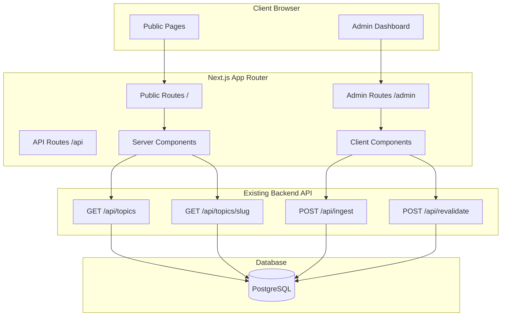

# Design Document

## Overview

This design document outlines the architecture and implementation details for a WordPress-like CMS frontend that integrates with the existing Q&A Article FAQ API. The system will be built using Next.js 14+ App Router with server-side rendering for SEO, React Server Components for performance, and a modern component-based architecture.

The CMS consists of two main areas:
1. **Public Frontend**: SEO-optimized pages for visitors to browse and read content
2. **Admin Dashboard**: Secure interface for content management

### Technology Stack

- **Framework**: Next.js 14+ (App Router)
- **UI Library**: React 18+
- **Styling**: Tailwind CSS for utility-first styling
- **Component Library**: shadcn/ui for pre-built accessible components
- **Rich Text Editor**: Tiptap or React-Quill for article editing
- **Authentication**: NextAuth.js for admin authentication
- **Form Handling**: React Hook Form with Zod validation
- **State Management**: React Context + Server Components (minimal client state)
- **API Integration**: Native fetch with Next.js caching
- **Icons**: Lucide React
- **SEO**: next-seo for meta tags management

## Architecture

### High-Level Architecture



### Directory Structure


```
src/
├── app/
│   ├── (public)/                    # Public-facing pages
│   │   ├── layout.tsx              # Public layout with header/footer
│   │   ├── page.tsx                # Homepage
│   │   ├── topics/
│   │   │   ├── page.tsx            # Topics listing
│   │   │   └── [slug]/
│   │   │       └── page.tsx        # Individual topic page
│   │   └── search/
│   │       └── page.tsx            # Search results page
│   │
│   ├── admin/                       # Admin dashboard
│   │   ├── layout.tsx              # Admin layout with sidebar
│   │   ├── page.tsx                # Dashboard home
│   │   ├── login/
│   │   │   └── page.tsx            # Login page
│   │   ├── topics/
│   │   │   ├── page.tsx            # Topics management list
│   │   │   ├── new/
│   │   │   │   └── page.tsx        # Create new topic
│   │   │   └── [slug]/
│   │   │       └── edit/
│   │   │           └── page.tsx    # Edit topic
│   │   └── settings/
│   │       └── page.tsx            # Admin settings
│   │
│   ├── api/                         # Existing API routes
│   │   ├── auth/                   # NextAuth.js routes
│   │   │   └── [...nextauth]/
│   │   │       └── route.ts
│   │   ├── ingest/                 # Existing
│   │   ├── topics/                 # Existing
│   │   └── revalidate/             # Existing
│   │
│   ├── layout.tsx                   # Root layout
│   └── globals.css                  # Global styles
│
├── components/
│   ├── public/                      # Public-facing components
│   │   ├── Header.tsx
│   │   ├── Footer.tsx
│   │   ├── TopicCard.tsx
│   │   ├── SearchBar.tsx
│   │   ├── TagFilter.tsx
│   │   └── FAQAccordion.tsx
│   │
│   ├── admin/                       # Admin dashboard components
│   │   ├── Sidebar.tsx
│   │   ├── TopicForm.tsx
│   │   ├── RichTextEditor.tsx
│   │   ├── FAQManager.tsx
│   │   └── TopicList.tsx
│   │
│   └── ui/                          # Shared UI components (shadcn/ui)
│       ├── button.tsx
│       ├── input.tsx
│       ├── card.tsx
│       ├── dialog.tsx
│       └── ...
│
├── lib/
│   ├── api/                         # API client functions
│   │   ├── topics.ts               # Topic API calls
│   │   ├── ingest.ts               # Ingest API calls
│   │   └── auth.ts                 # Auth helpers
│   │
│   ├── hooks/                       # Custom React hooks
│   │   ├── useTopics.ts
│   │   ├── useSearch.ts
│   │   └── useAuth.ts
│   │
│   ├── utils/                       # Utility functions
│   │   ├── seo.ts                  # SEO helpers
│   │   ├── formatting.ts           # Text formatting
│   │   └── validation.ts           # Form validation schemas
│   │
│   └── auth.ts                      # NextAuth.js configuration
│
└── types/
    ├── topic.ts                     # Topic type definitions
    └── admin.ts                     # Admin type definitions
```

## Components and Interfaces

### Public Components

#### 1. Header Component

**Purpose**: Main navigation header for public pages

**Props**:
```typescript
interface HeaderProps {
  currentLocale?: string;
  showSearch?: boolean;
}
```

**Features**:
- Logo and site title
- Main navigation menu (responsive hamburger on mobile)
- Search bar (optional)
- Locale switcher
- Sticky header on scroll

#### 2. TopicCard Component

**Purpose**: Display topic preview in listing pages

**Props**:
```typescript
interface TopicCardProps {
  topic: {
    slug: string;
    title: string;
    locale: string;
    tags: string[];
    createdAt: string;
    updatedAt: string;
  };
  variant?: 'default' | 'featured';
}
```

**Features**:
- Clickable card linking to topic page
- Display title, tags, and date
- Hover effects
- Responsive grid layout

#### 3. FAQAccordion Component

**Purpose**: Display FAQ items in an expandable accordion

**Props**:
```typescript
interface FAQAccordionProps {
  items: Array<{
    id: string;
    question: string;
    answer: string;
    order: number;
  }>;
}
```

**Features**:
- Expand/collapse individual items
- Smooth animations
- Keyboard navigation
- Accessible ARIA attributes

#### 4. SearchBar Component

**Purpose**: Real-time search functionality

**Props**:
```typescript
interface SearchBarProps {
  onSearch: (query: string) => void;
  placeholder?: string;
  variant?: 'header' | 'page';
}
```

**Features**:
- Debounced input
- Clear button
- Loading state
- Keyboard shortcuts (Cmd+K)

### Admin Components

#### 1. Sidebar Component

**Purpose**: Admin dashboard navigation

**Props**:
```typescript
interface SidebarProps {
  currentPath: string;
  user: {
    name: string;
    email: string;
  };
}
```

**Features**:
- Navigation links
- Active state highlighting
- User profile section
- Logout button
- Collapsible on mobile

#### 2. TopicForm Component

**Purpose**: Create/edit topic form

**Props**:
```typescript
interface TopicFormProps {
  initialData?: Topic;
  onSubmit: (data: TopicFormData) => Promise<void>;
  mode: 'create' | 'edit';
}

interface TopicFormData {
  slug: string;
  title: string;
  locale: string;
  tags: string[];
  mainQuestion: string;
  articleContent: string;
  articleStatus: 'DRAFT' | 'PUBLISHED';
  faqItems: Array<{
    question: string;
    answer: string;
    order: number;
  }>;
}
```

**Features**:
- Form validation with Zod
- Auto-generate slug from title
- Tag input with autocomplete
- Rich text editor for article
- FAQ manager integration
- Save as draft or publish
- Preview mode

#### 3. RichTextEditor Component

**Purpose**: WYSIWYG editor for article content

**Props**:
```typescript
interface RichTextEditorProps {
  content: string;
  onChange: (content: string) => void;
  placeholder?: string;
}
```

**Features**:
- Formatting toolbar (bold, italic, headings, lists, links)
- Markdown support
- Image upload
- Code blocks
- Preview mode
- Character count

#### 4. FAQManager Component

**Purpose**: Manage FAQ items within topic form

**Props**:
```typescript
interface FAQManagerProps {
  items: FAQItem[];
  onChange: (items: FAQItem[]) => void;
}

interface FAQItem {
  id?: string;
  question: string;
  answer: string;
  order: number;
}
```

**Features**:
- Add new FAQ items
- Edit existing items
- Delete items with confirmation
- Drag-and-drop reordering
- Inline editing

## Data Models

### Frontend Type Definitions

```typescript
// Topic types
export interface Topic {
  id: string;
  slug: string;
  title: string;
  locale: string;
  tags: string[];
  createdAt: string;
  updatedAt: string;
}

export interface TopicDetail extends Topic {
  primaryQuestion: Question;
  article: Article;
  faqItems: FAQItem[];
}

export interface Question {
  id: string;
  text: string;
  isPrimary: boolean;
  createdAt: string;
  updatedAt: string;
}

export interface Article {
  id: string;
  content: string;
  status: 'DRAFT' | 'PUBLISHED';
  createdAt: string;
  updatedAt: string;
}

export interface FAQItem {
  id: string;
  question: string;
  answer: string;
  order: number;
  createdAt: string;
  updatedAt: string;
}

// API response types
export interface TopicsListResponse {
  items: Topic[];
  total: number;
  page: number;
  limit: number;
  totalPages: number;
}

export interface TopicDetailResponse {
  topic: Topic;
  primaryQuestion: Question;
  article: Article;
  faqItems: FAQItem[];
}

// Ingest payload type
export interface IngestPayload {
  topic: {
    slug: string;
    title: string;
    locale: string;
    tags: string[];
  };
  mainQuestion: {
    text: string;
  };
  article: {
    content: string;
    status: 'DRAFT' | 'PUBLISHED';
  };
  faqItems: Array<{
    question: string;
    answer: string;
    order: number;
  }>;
}
```

## API Integration Layer

### API Client Functions

```typescript
// lib/api/topics.ts
export async function getTopics(params?: {
  locale?: string;
  tag?: string;
  page?: number;
  limit?: number;
}): Promise<TopicsListResponse> {
  const searchParams = new URLSearchParams();
  if (params?.locale) searchParams.set('locale', params.locale);
  if (params?.tag) searchParams.set('tag', params.tag);
  if (params?.page) searchParams.set('page', params.page.toString());
  if (params?.limit) searchParams.set('limit', params.limit.toString());
  
  const res = await fetch(`/api/topics?${searchParams}`, {
    next: { tags: ['topics'] }
  });
  
  if (!res.ok) throw new Error('Failed to fetch topics');
  return res.json();
}

export async function getTopicBySlug(slug: string): Promise<TopicDetailResponse> {
  const res = await fetch(`/api/topics/${slug}`, {
    next: { tags: ['topics', `topic:${slug}`] }
  });
  
  if (!res.ok) throw new Error('Failed to fetch topic');
  return res.json();
}

// lib/api/ingest.ts
export async function createOrUpdateTopic(
  payload: IngestPayload
): Promise<{ success: boolean; topicId: string }> {
  const timestamp = Date.now().toString();
  const signature = await generateSignature(timestamp, payload);
  
  const res = await fetch('/api/ingest', {
    method: 'POST',
    headers: {
      'Content-Type': 'application/json',
      'x-api-key': process.env.NEXT_PUBLIC_INGEST_API_KEY!,
      'x-timestamp': timestamp,
      'x-signature': signature,
    },
    body: JSON.stringify(payload),
  });
  
  if (!res.ok) throw new Error('Failed to ingest topic');
  return res.json();
}

export async function revalidateCache(tag: string): Promise<void> {
  const timestamp = Date.now().toString();
  const body = { tag };
  const signature = await generateSignature(timestamp, body);
  
  const res = await fetch('/api/revalidate', {
    method: 'POST',
    headers: {
      'Content-Type': 'application/json',
      'x-api-key': process.env.NEXT_PUBLIC_INGEST_API_KEY!,
      'x-timestamp': timestamp,
      'x-signature': signature,
    },
    body: JSON.stringify(body),
  });
  
  if (!res.ok) throw new Error('Failed to revalidate cache');
}

async function generateSignature(timestamp: string, body: any): Promise<string> {
  const payload = `${timestamp}.${JSON.stringify(body)}`;
  const encoder = new TextEncoder();
  const key = await crypto.subtle.importKey(
    'raw',
    encoder.encode(process.env.NEXT_PUBLIC_INGEST_WEBHOOK_SECRET!),
    { name: 'HMAC', hash: 'SHA-256' },
    false,
    ['sign']
  );
  const signature = await crypto.subtle.sign('HMAC', key, encoder.encode(payload));
  return Array.from(new Uint8Array(signature))
    .map(b => b.toString(16).padStart(2, '0'))
    .join('');
}
```

## Routing Strategy

### Public Routes (Server Components)

- `/` - Homepage with featured topics
- `/topics` - Topics listing with filters
- `/topics/[slug]` - Individual topic page
- `/search` - Search results page

**Caching Strategy**:
- Use Next.js `fetch` with `next: { tags: [...] }` for cache tagging
- Revalidate on-demand via `/api/revalidate`
- Static generation for topic pages with ISR

### Admin Routes (Client Components with Auth)

- `/admin` - Dashboard home
- `/admin/login` - Login page
- `/admin/topics` - Topics management
- `/admin/topics/new` - Create new topic
- `/admin/topics/[slug]/edit` - Edit topic
- `/admin/settings` - Admin settings

**Authentication**:
- Middleware to protect `/admin/*` routes
- Redirect to `/admin/login` if not authenticated
- Session-based auth with NextAuth.js

## SEO Implementation

### Meta Tags Strategy

Each public page will include:

```typescript
// lib/utils/seo.ts
export function generateTopicMetadata(topic: TopicDetailResponse) {
  const title = `${topic.topic.title} | Your Site Name`;
  const description = topic.article.content.substring(0, 160);
  const url = `https://yoursite.com/topics/${topic.topic.slug}`;
  
  return {
    title,
    description,
    openGraph: {
      title,
      description,
      url,
      type: 'article',
      locale: topic.topic.locale,
      tags: topic.topic.tags,
    },
    twitter: {
      card: 'summary_large_image',
      title,
      description,
    },
    alternates: {
      canonical: url,
    },
  };
}
```

### Structured Data (JSON-LD)

```typescript
export function generateArticleSchema(topic: TopicDetailResponse) {
  return {
    '@context': 'https://schema.org',
    '@type': 'Article',
    headline: topic.topic.title,
    description: topic.article.content.substring(0, 160),
    datePublished: topic.article.createdAt,
    dateModified: topic.article.updatedAt,
    author: {
      '@type': 'Organization',
      name: 'Your Organization',
    },
    mainEntity: {
      '@type': 'Question',
      name: topic.primaryQuestion.text,
      acceptedAnswer: {
        '@type': 'Answer',
        text: topic.article.content,
      },
    },
  };
}

export function generateFAQSchema(faqItems: FAQItem[]) {
  return {
    '@context': 'https://schema.org',
    '@type': 'FAQPage',
    mainEntity: faqItems.map(item => ({
      '@type': 'Question',
      name: item.question,
      acceptedAnswer: {
        '@type': 'Answer',
        text: item.answer,
      },
    })),
  };
}
```

### Sitemap Generation

```typescript
// app/sitemap.ts
export default async function sitemap() {
  const topics = await getTopics({ limit: 1000 });
  
  return [
    {
      url: 'https://yoursite.com',
      lastModified: new Date(),
      changeFrequency: 'daily',
      priority: 1,
    },
    {
      url: 'https://yoursite.com/topics',
      lastModified: new Date(),
      changeFrequency: 'daily',
      priority: 0.8,
    },
    ...topics.items.map(topic => ({
      url: `https://yoursite.com/topics/${topic.slug}`,
      lastModified: new Date(topic.updatedAt),
      changeFrequency: 'weekly',
      priority: 0.6,
    })),
  ];
}
```

## Responsive Design System

### Breakpoints

```typescript
// tailwind.config.js
module.exports = {
  theme: {
    screens: {
      'sm': '640px',   // Mobile landscape
      'md': '768px',   // Tablet
      'lg': '1024px',  // Desktop
      'xl': '1280px',  // Large desktop
      '2xl': '1536px', // Extra large
    },
  },
};
```

### Layout Patterns

#### Mobile (< 768px)
- Single column layout
- Hamburger menu
- Stacked form fields
- Full-width cards
- Bottom navigation for admin

#### Tablet (768px - 1024px)
- Two-column grid for topic cards
- Collapsible sidebar for admin
- Adaptive forms

#### Desktop (> 1024px)
- Three-column grid for topic cards
- Fixed sidebar for admin
- Multi-column forms
- Hover effects

### Component Responsiveness

```typescript
// Example: Responsive TopicCard
<div className="
  w-full
  sm:w-1/2 sm:p-2
  lg:w-1/3 lg:p-4
  hover:shadow-lg
  transition-shadow
">
  {/* Card content */}
</div>

// Example: Responsive Header
<header className="
  sticky top-0 z-50
  bg-white shadow-md
  px-4 py-3
  md:px-6 md:py-4
">
  <nav className="
    flex items-center justify-between
    max-w-7xl mx-auto
  ">
    {/* Mobile: Hamburger */}
    <button className="md:hidden">
      <MenuIcon />
    </button>
    
    {/* Desktop: Full menu */}
    <ul className="hidden md:flex gap-6">
      {/* Menu items */}
    </ul>
  </nav>
</header>
```

## Authentication & Authorization

### NextAuth.js Configuration

```typescript
// lib/auth.ts
import NextAuth from 'next-auth';
import CredentialsProvider from 'next-auth/providers/credentials';

export const authOptions = {
  providers: [
    CredentialsProvider({
      name: 'Credentials',
      credentials: {
        email: { label: 'Email', type: 'email' },
        password: { label: 'Password', type: 'password' },
      },
      async authorize(credentials) {
        // Validate against environment variables or database
        if (
          credentials?.email === process.env.ADMIN_EMAIL &&
          credentials?.password === process.env.ADMIN_PASSWORD
        ) {
          return {
            id: '1',
            email: credentials.email,
            name: 'Admin',
          };
        }
        return null;
      },
    }),
  ],
  pages: {
    signIn: '/admin/login',
  },
  callbacks: {
    async jwt({ token, user }) {
      if (user) {
        token.id = user.id;
      }
      return token;
    },
    async session({ session, token }) {
      if (session.user) {
        session.user.id = token.id as string;
      }
      return session;
    },
  },
};

export default NextAuth(authOptions);
```

### Middleware Protection

```typescript
// middleware.ts
import { withAuth } from 'next-auth/middleware';

export default withAuth({
  callbacks: {
    authorized: ({ token }) => !!token,
  },
});

export const config = {
  matcher: ['/admin/:path*'],
};
```

## Error Handling

### Error Boundaries

```typescript
// components/ErrorBoundary.tsx
'use client';

export default function ErrorBoundary({
  error,
  reset,
}: {
  error: Error;
  reset: () => void;
}) {
  return (
    <div className="min-h-screen flex items-center justify-center">
      <div className="text-center">
        <h2 className="text-2xl font-bold mb-4">Something went wrong!</h2>
        <p className="text-gray-600 mb-4">{error.message}</p>
        <button
          onClick={reset}
          className="px-4 py-2 bg-blue-600 text-white rounded hover:bg-blue-700"
        >
          Try again
        </button>
      </div>
    </div>
  );
}
```

### API Error Handling

```typescript
// lib/api/errors.ts
export class APIError extends Error {
  constructor(
    message: string,
    public statusCode: number,
    public code?: string
  ) {
    super(message);
    this.name = 'APIError';
  }
}

export async function handleAPIResponse<T>(response: Response): Promise<T> {
  if (!response.ok) {
    const error = await response.json().catch(() => ({}));
    throw new APIError(
      error.message || 'An error occurred',
      response.status,
      error.code
    );
  }
  return response.json();
}
```

### Form Validation

```typescript
// lib/utils/validation.ts
import { z } from 'zod';

export const topicFormSchema = z.object({
  slug: z.string().min(1).regex(/^[a-z0-9-]+$/),
  title: z.string().min(1).max(200),
  locale: z.string().length(2),
  tags: z.array(z.string()).min(1),
  mainQuestion: z.string().min(10),
  articleContent: z.string().min(50),
  articleStatus: z.enum(['DRAFT', 'PUBLISHED']),
  faqItems: z.array(
    z.object({
      question: z.string().min(5),
      answer: z.string().min(10),
      order: z.number().int().min(0),
    })
  ),
});

export type TopicFormSchema = z.infer<typeof topicFormSchema>;
```

## Testing Strategy

### Unit Tests
- Component rendering tests
- Utility function tests
- Form validation tests

### Integration Tests
- API client function tests
- Authentication flow tests
- Form submission tests

### E2E Tests
- Public page navigation
- Admin CRUD operations
- Search functionality
- Mobile responsiveness

### Testing Tools
- **Vitest**: Unit and integration tests
- **React Testing Library**: Component tests
- **Playwright**: E2E tests (optional)

## Performance Optimization

### Image Optimization
- Use Next.js `<Image>` component
- Lazy loading for below-the-fold images
- WebP format with fallbacks
- Responsive image sizes

### Code Splitting
- Dynamic imports for heavy components
- Route-based code splitting (automatic with App Router)
- Lazy load admin components

### Caching Strategy
- Static generation for public pages
- ISR (Incremental Static Regeneration) for topic pages
- On-demand revalidation via `/api/revalidate`
- Client-side caching with SWR or React Query (optional)

### Bundle Optimization
- Tree shaking
- Minimize client-side JavaScript
- Use Server Components by default
- Only mark components as 'use client' when necessary

## Accessibility

### WCAG 2.1 AA Compliance
- Semantic HTML elements
- ARIA labels and roles
- Keyboard navigation support
- Focus management
- Color contrast ratios
- Screen reader compatibility

### Implementation
```typescript
// Example: Accessible button
<button
  aria-label="Close dialog"
  onClick={handleClose}
  className="focus:outline-none focus:ring-2 focus:ring-blue-500"
>
  <XIcon aria-hidden="true" />
</button>

// Example: Accessible form
<form onSubmit={handleSubmit}>
  <label htmlFor="title" className="block mb-2">
    Topic Title
  </label>
  <input
    id="title"
    type="text"
    aria-required="true"
    aria-invalid={!!errors.title}
    aria-describedby={errors.title ? 'title-error' : undefined}
  />
  {errors.title && (
    <p id="title-error" role="alert" className="text-red-600">
      {errors.title.message}
    </p>
  )}
</form>
```

## Design System

### Color Palette

```typescript
// tailwind.config.js
module.exports = {
  theme: {
    extend: {
      colors: {
        primary: {
          50: '#eff6ff',
          100: '#dbeafe',
          500: '#3b82f6',
          600: '#2563eb',
          700: '#1d4ed8',
        },
        secondary: {
          50: '#f8fafc',
          100: '#f1f5f9',
          500: '#64748b',
          600: '#475569',
          700: '#334155',
        },
        success: '#10b981',
        warning: '#f59e0b',
        error: '#ef4444',
      },
    },
  },
};
```

### Typography

```typescript
// Global styles
const typography = {
  h1: 'text-4xl md:text-5xl font-bold leading-tight',
  h2: 'text-3xl md:text-4xl font-bold leading-tight',
  h3: 'text-2xl md:text-3xl font-semibold leading-snug',
  h4: 'text-xl md:text-2xl font-semibold leading-snug',
  body: 'text-base leading-relaxed',
  small: 'text-sm leading-normal',
};
```

### Spacing & Layout

```typescript
// Consistent spacing scale
const spacing = {
  section: 'py-12 md:py-16 lg:py-20',
  container: 'max-w-7xl mx-auto px-4 sm:px-6 lg:px-8',
  card: 'p-4 md:p-6',
  gap: 'gap-4 md:gap-6 lg:gap-8',
};
```

## Deployment Considerations

### Environment Variables

```bash
# Public variables (exposed to browser)
NEXT_PUBLIC_SITE_URL=https://yoursite.com
NEXT_PUBLIC_INGEST_API_KEY=your-api-key
NEXT_PUBLIC_INGEST_WEBHOOK_SECRET=your-webhook-secret

# Private variables (server-only)
DATABASE_URL=postgresql://...
NEXTAUTH_SECRET=your-nextauth-secret
NEXTAUTH_URL=https://yoursite.com
ADMIN_EMAIL=admin@yoursite.com
ADMIN_PASSWORD=secure-password
```

### Build Configuration

```javascript
// next.config.js
module.exports = {
  images: {
    domains: ['yourcdn.com'],
    formats: ['image/webp', 'image/avif'],
  },
  experimental: {
    optimizeCss: true,
  },
};
```

## Future Enhancements

- Multi-language support with i18n
- Image upload and media library
- Bulk import/export functionality
- Analytics dashboard
- Comment system for articles
- Version history for articles
- User roles and permissions
- Email notifications
- Dark mode support
