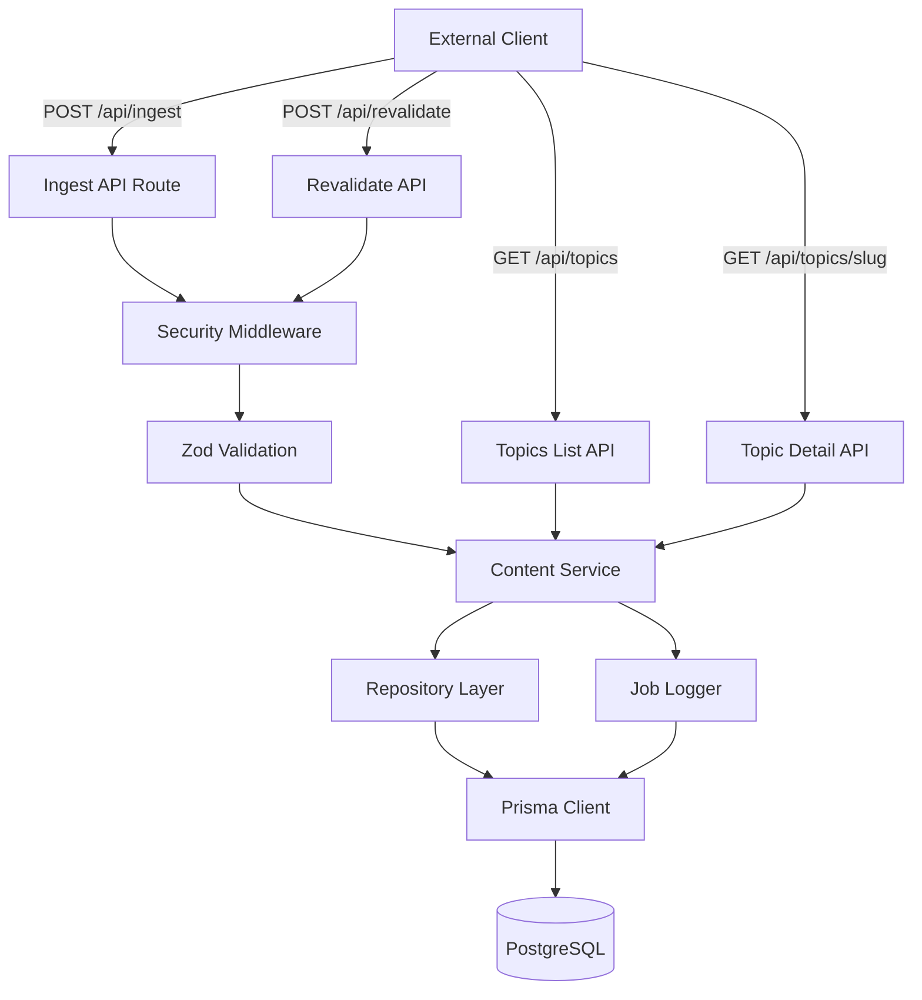

# Design Document

## Overview

This design implements a secure, API-first backend for Q&A, article, and FAQ content management using Next.js 14+ App Router with TypeScript. The system follows a layered architecture with clear separation between API routes, business logic, data access, and security middleware. Content ingestion uses webhook-style HMAC authentication, while public read endpoints remain open. The design prioritizes security, idempotency, and testability.

## Architecture

### High-Level Architecture



### Technology Stack

- **Framework**: Next.js 14+ (App Router, TypeScript)
- **ORM**: Prisma
- **Database**: PostgreSQL (Neon/Supabase)
- **Validation**: Zod
- **Testing**: Vitest
- **Security**: HMAC-SHA256, timing-safe comparison

### Directory Structure

```
/
├── prisma/
│   ├── schema.prisma          # Database schema
│   └── migrations/            # Migration files
├── src/
│   ├── app/
│   │   └── api/
│   │       ├── ingest/
│   │       │   └── route.ts   # POST /api/ingest
│   │       ├── topics/
│   │       │   ├── route.ts   # GET /api/topics (list)
│   │       │   └── [slug]/
│   │       │       └── route.ts # GET /api/topics/[slug]
│   │       └── revalidate/
│   │           └── route.ts   # POST /api/revalidate
│   ├── lib/
│   │   ├── security/
│   │   │   ├── hmac.ts        # HMAC signature verification
│   │   │   └── timing.ts      # Timing-safe comparison
│   │   ├── validation/
│   │   │   └── schemas.ts     # Zod schemas
│   │   ├── services/
│   │   │   ├── content.service.ts  # Business logic
│   │   │   └── job.service.ts      # IngestJob logging
│   │   ├── repositories/
│   │   │   └── content.repository.ts # Data access
│   │   └── db.ts              # Prisma client singleton
│   └── types/
│       └── api.ts             # Shared TypeScript types
└── tests/
    └── api/
        ├── ingest.test.ts     # Ingest endpoint tests
        ├── topics.test.ts     # Topics endpoint tests
        └── revalidate.test.ts # Revalidate endpoint tests
```

## Components and Interfaces

### 1. Security Middleware

**Purpose**: Validate HMAC signatures and API keys for protected endpoints.

**Interface**:
```typescript
interface SecurityValidationResult {
  valid: boolean;
  error?: string;
}

interface SecurityHeaders {
  apiKey: string;
  timestamp: string;
  signature: string;
}

function validateSecurity(
  headers: SecurityHeaders,
  rawBody: string
): SecurityValidationResult;

function timingSafeCompare(a: string, b: string): boolean;
```

**Implementation Details**:
- Extract `x-api-key`, `x-timestamp`, `x-signature` from headers
- Validate API key against `INGEST_API_KEY` environment variable
- Check timestamp is within ±5 minutes of current time
- Compute HMAC-SHA256 signature: `HMAC(INGEST_WEBHOOK_SECRET, timestamp + "." + rawBody)`
- Compare signatures using timing-safe comparison
- Return validation result with specific error messages

### 2. Validation Layer

**Purpose**: Define and enforce request/response schemas using Zod.

**Schemas**:
```typescript
// Ingest payload schema
const IngestPayloadSchema = z.object({
  topic: z.object({
    slug: z.string().min(1).max(255),
    title: z.string().min(1),
    locale: z.string().length(2), // e.g., "en", "es"
    tags: z.array(z.string()).default([])
  }),
  mainQuestion: z.object({
    text: z.string().min(1)
  }),
  article: z.object({
    content: z.string().min(1),
    status: z.enum(['DRAFT', 'PUBLISHED'])
  }),
  faqItems: z.array(z.object({
    question: z.string().min(1),
    answer: z.string().min(1),
    order: z.number().int().min(0)
  })).default([])
});

// Revalidate payload schema
const RevalidatePayloadSchema = z.object({
  tag: z.string().min(1)
});

// Query parameters for listing
const TopicsQuerySchema = z.object({
  locale: z.string().length(2).optional(),
  tag: z.string().optional(),
  page: z.coerce.number().int().min(1).default(1),
  limit: z.coerce.number().int().min(1).max(100).default(20)
});
```

### 3. Repository Layer

**Purpose**: Abstract database operations using Prisma.

**Interface**:
```typescript
interface ContentRepository {
  // Topic operations
  upsertTopic(data: TopicUpsertData): Promise<Topic>;
  findTopicBySlug(slug: string): Promise<TopicWithRelations | null>;
  findTopics(filters: TopicFilters): Promise<PaginatedTopics>;
  
  // Question operations
  upsertPrimaryQuestion(topicId: string, text: string): Promise<Question>;
  
  // Article operations
  upsertArticle(topicId: string, data: ArticleData): Promise<Article>;
  
  // FAQ operations
  replaceFAQItems(topicId: string, items: FAQItemData[]): Promise<FAQItem[]>;
  
  // Job operations
  createIngestJob(topicSlug: string, payload: unknown): Promise<IngestJob>;
  updateIngestJob(id: string, updates: JobUpdates): Promise<IngestJob>;
}
```

**Implementation Details**:
- Use Prisma transactions for atomic operations
- Implement upsert logic using `upsert` or `findUnique` + `create`/`update`
- For FAQ replacement: delete existing items, then bulk create new ones within transaction
- Include proper error handling and logging

### 4. Service Layer

**Purpose**: Orchestrate business logic and coordinate repository operations.

**Interface**:
```typescript
interface ContentService {
  ingestContent(payload: IngestPayload): Promise<IngestResult>;
  getTopicBySlug(slug: string): Promise<UnifiedTopic | null>;
  listTopics(filters: TopicFilters): Promise<PaginatedTopics>;
}

interface IngestResult {
  success: boolean;
  topicId: string;
  jobId: string;
}

interface UnifiedTopic {
  topic: Topic;
  primaryQuestion: Question | null;
  article: Article | null;
  faqItems: FAQItem[];
}
```

**Implementation Details**:
- `ingestContent`: 
  1. Create IngestJob with status "processing"
  2. Execute upsert operations in transaction
  3. Update IngestJob to "completed" or "failed"
  4. Return result with IDs
- `getTopicBySlug`:
  1. Fetch topic with relations (questions, articles, faqItems)
  2. Filter for isPrimary question and PUBLISHED article
  3. Sort FAQ items by order field
  4. Return unified structure or null
- `listTopics`:
  1. Apply filters (locale, tag)
  2. Only include topics with PUBLISHED articles
  3. Calculate pagination metadata
  4. Return paginated results

### 5. API Routes

**Purpose**: Handle HTTP requests and responses.

#### POST /api/ingest

```typescript
export async function POST(request: Request) {
  // 1. Extract raw body for signature verification
  const rawBody = await request.text();
  
  // 2. Validate security headers
  const securityResult = validateSecurity({
    apiKey: request.headers.get('x-api-key'),
    timestamp: request.headers.get('x-timestamp'),
    signature: request.headers.get('x-signature')
  }, rawBody);
  
  if (!securityResult.valid) {
    return NextResponse.json(
      { error: securityResult.error },
      { status: 401 }
    );
  }
  
  // 3. Parse and validate JSON body
  const parseResult = IngestPayloadSchema.safeParse(JSON.parse(rawBody));
  if (!parseResult.success) {
    return NextResponse.json(
      { error: 'Validation failed', details: parseResult.error.format() },
      { status: 400 }
    );
  }
  
  // 4. Process ingestion
  try {
    const result = await contentService.ingestContent(parseResult.data);
    return NextResponse.json(result, { status: 200 });
  } catch (error) {
    console.error('Ingest error:', error);
    return NextResponse.json(
      { error: 'Internal server error' },
      { status: 500 }
    );
  }
}
```

#### GET /api/topics/[slug]

```typescript
export async function GET(
  request: Request,
  { params }: { params: { slug: string } }
) {
  try {
    const topic = await contentService.getTopicBySlug(params.slug);
    
    if (!topic) {
      return NextResponse.json(
        { error: 'Topic not found' },
        { status: 404 }
      );
    }
    
    return NextResponse.json(topic, { status: 200 });
  } catch (error) {
    console.error('Get topic error:', error);
    return NextResponse.json(
      { error: 'Internal server error' },
      { status: 500 }
    );
  }
}
```

#### GET /api/topics

```typescript
export async function GET(request: Request) {
  const { searchParams } = new URL(request.url);
  
  const queryResult = TopicsQuerySchema.safeParse({
    locale: searchParams.get('locale'),
    tag: searchParams.get('tag'),
    page: searchParams.get('page'),
    limit: searchParams.get('limit')
  });
  
  if (!queryResult.success) {
    return NextResponse.json(
      { error: 'Invalid query parameters', details: queryResult.error.format() },
      { status: 400 }
    );
  }
  
  try {
    const result = await contentService.listTopics(queryResult.data);
    return NextResponse.json(result, { status: 200 });
  } catch (error) {
    console.error('List topics error:', error);
    return NextResponse.json(
      { error: 'Internal server error' },
      { status: 500 }
    );
  }
}
```

#### POST /api/revalidate

```typescript
export async function POST(request: Request) {
  const rawBody = await request.text();
  
  // Validate security (same as ingest)
  const securityResult = validateSecurity({
    apiKey: request.headers.get('x-api-key'),
    timestamp: request.headers.get('x-timestamp'),
    signature: request.headers.get('x-signature')
  }, rawBody);
  
  if (!securityResult.valid) {
    return NextResponse.json(
      { error: securityResult.error },
      { status: 401 }
    );
  }
  
  // Parse and validate payload
  const parseResult = RevalidatePayloadSchema.safeParse(JSON.parse(rawBody));
  if (!parseResult.success) {
    return NextResponse.json(
      { error: 'Validation failed', details: parseResult.error.format() },
      { status: 400 }
    );
  }
  
  // Revalidate tag
  revalidateTag(parseResult.data.tag);
  
  return NextResponse.json(
    { message: 'Revalidated successfully', tag: parseResult.data.tag },
    { status: 200 }
  );
}
```

## Data Models

### Prisma Schema

```prisma
generator client {
  provider = "prisma-client-js"
}

datasource db {
  provider = "postgresql"
  url      = env("DATABASE_URL")
}

enum ContentStatus {
  DRAFT
  PUBLISHED
}

model Topic {
  id        String   @id @default(cuid())
  slug      String   @unique
  title     String
  locale    String
  tags      String[]
  createdAt DateTime @default(now())
  updatedAt DateTime @updatedAt

  questions Question[]
  articles  Article[]
  faqItems  FAQItem[]

  @@index([slug])
  @@index([locale])
  @@index([tags])
}

model Question {
  id        String   @id @default(cuid())
  topicId   String
  text      String
  isPrimary Boolean  @default(false)
  createdAt DateTime @default(now())
  updatedAt DateTime @updatedAt

  topic Topic @relation(fields: [topicId], references: [id], onDelete: Cascade)

  @@index([topicId])
  @@index([topicId, isPrimary])
}

model Article {
  id        String        @id @default(cuid())
  topicId   String        @unique
  content   String        @db.Text
  status    ContentStatus @default(DRAFT)
  createdAt DateTime      @default(now())
  updatedAt DateTime      @updatedAt

  topic Topic @relation(fields: [topicId], references: [id], onDelete: Cascade)

  @@index([topicId, status])
}

model FAQItem {
  id        String   @id @default(cuid())
  topicId   String
  question  String
  answer    String   @db.Text
  order     Int
  createdAt DateTime @default(now())
  updatedAt DateTime @updatedAt

  topic Topic @relation(fields: [topicId], references: [id], onDelete: Cascade)

  @@index([topicId])
  @@index([topicId, order])
}

model IngestJob {
  id          String    @id @default(cuid())
  topicSlug   String
  status      String    // "processing", "completed", "failed"
  payload     Json
  error       String?   @db.Text
  createdAt   DateTime  @default(now())
  completedAt DateTime?

  @@index([topicSlug])
  @@index([status])
  @@index([createdAt])
}
```

### Key Design Decisions

1. **Topic.slug as unique identifier**: Enables clean URLs and stable references
2. **Article.topicId as unique**: One article per topic (one-to-one relationship)
3. **Question.isPrimary flag**: Allows multiple questions but identifies the main one
4. **FAQItem.order field**: Explicit ordering for FAQ display
5. **IngestJob.payload as JSON**: Stores complete request for debugging and replay
6. **Cascade deletes**: Ensures referential integrity when topics are removed
7. **Indexes**: Optimized for common query patterns (slug lookup, locale/tag filtering, status filtering)

## Error Handling

### Error Categories

1. **Authentication Errors (401)**
   - Invalid API key
   - Expired timestamp
   - Invalid signature
   - Response: `{ error: "Unauthorized", details: "..." }`

2. **Validation Errors (400)**
   - Malformed JSON
   - Zod schema violations
   - Missing required fields
   - Response: `{ error: "Validation failed", details: {...} }`

3. **Not Found Errors (404)**
   - Topic slug doesn't exist
   - Response: `{ error: "Topic not found" }`

4. **Server Errors (500)**
   - Database connection failures
   - Unexpected exceptions
   - Response: `{ error: "Internal server error" }`
   - Log full error details server-side

### Error Handling Strategy

- Use try-catch blocks in API routes
- Log errors with context (request ID, timestamp, user info if available)
- Return generic messages to clients for 500 errors
- Include detailed validation errors for 400 responses
- Use Prisma error codes to distinguish constraint violations from other DB errors

## Testing Strategy

### Test Environment Setup

- Use Vitest with in-memory SQLite or test PostgreSQL database
- Seed test data before each test suite
- Clean database after each test
- Mock environment variables for security credentials

### Test Categories

#### 1. Security Tests

```typescript
describe('POST /api/ingest - Security', () => {
  test('rejects request with invalid API key', async () => {
    const response = await fetch('/api/ingest', {
      method: 'POST',
      headers: {
        'x-api-key': 'wrong-key',
        'x-timestamp': Date.now().toString(),
        'x-signature': 'invalid'
      },
      body: JSON.stringify(validPayload)
    });
    
    expect(response.status).toBe(401);
  });
  
  test('rejects request with expired timestamp', async () => {
    const oldTimestamp = Date.now() - (6 * 60 * 1000); // 6 minutes ago
    // ... test implementation
  });
  
  test('rejects request with invalid signature', async () => {
    // ... test implementation
  });
});
```

#### 2. Validation Tests

```typescript
describe('POST /api/ingest - Validation', () => {
  test('rejects payload with missing topic.slug', async () => {
    const invalidPayload = { ...validPayload };
    delete invalidPayload.topic.slug;
    
    const response = await authenticatedRequest('/api/ingest', invalidPayload);
    
    expect(response.status).toBe(400);
    expect(response.body.error).toBe('Validation failed');
  });
  
  test('rejects payload with invalid locale format', async () => {
    // ... test implementation
  });
});
```

#### 3. Idempotency Tests

```typescript
describe('POST /api/ingest - Idempotency', () => {
  test('produces identical results for duplicate requests', async () => {
    const payload = createTestPayload();
    
    const response1 = await authenticatedRequest('/api/ingest', payload);
    const response2 = await authenticatedRequest('/api/ingest', payload);
    
    expect(response1.status).toBe(200);
    expect(response2.status).toBe(200);
    
    const topic1 = await db.topic.findUnique({ where: { slug: payload.topic.slug } });
    const topic2 = await db.topic.findUnique({ where: { slug: payload.topic.slug } });
    
    expect(topic1).toEqual(topic2);
  });
});
```

#### 4. Business Logic Tests

```typescript
describe('GET /api/topics/[slug]', () => {
  test('returns unified topic with published article', async () => {
    await seedTopic({ slug: 'test-topic', articleStatus: 'PUBLISHED' });
    
    const response = await fetch('/api/topics/test-topic');
    
    expect(response.status).toBe(200);
    expect(response.body.topic.slug).toBe('test-topic');
    expect(response.body.article).toBeDefined();
    expect(response.body.faqItems).toBeArray();
  });
  
  test('returns 404 for non-existent topic', async () => {
    const response = await fetch('/api/topics/non-existent');
    expect(response.status).toBe(404);
  });
});

describe('GET /api/topics', () => {
  test('filters topics by locale', async () => {
    await seedTopics([
      { slug: 'en-topic', locale: 'en' },
      { slug: 'es-topic', locale: 'es' }
    ]);
    
    const response = await fetch('/api/topics?locale=en');
    
    expect(response.body.items).toHaveLength(1);
    expect(response.body.items[0].locale).toBe('en');
  });
  
  test('paginates results correctly', async () => {
    await seedTopics(25); // Create 25 topics
    
    const response = await fetch('/api/topics?page=2&limit=10');
    
    expect(response.body.items).toHaveLength(10);
    expect(response.body.page).toBe(2);
    expect(response.body.total).toBe(25);
  });
});
```

#### 5. Integration Tests

```typescript
describe('Content Ingestion Flow', () => {
  test('complete ingestion creates all related entities', async () => {
    const payload = {
      topic: { slug: 'full-test', title: 'Full Test', locale: 'en', tags: ['test'] },
      mainQuestion: { text: 'What is this?' },
      article: { content: 'This is content', status: 'PUBLISHED' },
      faqItems: [
        { question: 'Q1', answer: 'A1', order: 0 },
        { question: 'Q2', answer: 'A2', order: 1 }
      ]
    };
    
    const response = await authenticatedRequest('/api/ingest', payload);
    expect(response.status).toBe(200);
    
    const topic = await db.topic.findUnique({
      where: { slug: 'full-test' },
      include: { questions: true, articles: true, faqItems: true }
    });
    
    expect(topic).toBeDefined();
    expect(topic.questions).toHaveLength(1);
    expect(topic.questions[0].isPrimary).toBe(true);
    expect(topic.articles).toHaveLength(1);
    expect(topic.faqItems).toHaveLength(2);
  });
});
```

### Test Utilities

Create helper functions for common test operations:

```typescript
// Generate valid HMAC signature for test requests
function generateTestSignature(timestamp: string, body: string): string;

// Create authenticated request with proper headers
async function authenticatedRequest(url: string, payload: unknown): Promise<Response>;

// Seed database with test data
async function seedTopic(data: Partial<Topic>): Promise<Topic>;
async function seedTopics(count: number): Promise<Topic[]>;

// Clean database
async function cleanDatabase(): Promise<void>;
```

## Performance Considerations

1. **Database Indexes**: Added on frequently queried fields (slug, locale, tags, status)
2. **Pagination**: Limit query results to prevent large data transfers
3. **Transactions**: Use for atomic operations to maintain consistency
4. **Connection Pooling**: Leverage Prisma's built-in connection pooling
5. **Caching**: Next.js cache tags enable selective revalidation

## Security Considerations

1. **HMAC Verification**: Prevents request tampering and replay attacks (with timestamp window)
2. **Timing-Safe Comparison**: Prevents timing attacks on signature verification
3. **Environment Variables**: Sensitive credentials never hardcoded
4. **Input Validation**: Zod schemas prevent injection and malformed data
5. **Error Messages**: Generic messages for 500 errors to avoid information leakage
6. **CORS**: Configure appropriately for production (not in scope for this feature)

## Deployment Considerations

### Environment Variables

Required environment variables:
```
DATABASE_URL=postgresql://...
INGEST_API_KEY=<secure-random-key>
INGEST_WEBHOOK_SECRET=<secure-random-secret>
```

### Database Migration

1. Run `npx prisma migrate dev` in development
2. Run `npx prisma migrate deploy` in production
3. Ensure database backups before migrations

### Monitoring

- Log all ingest operations with IngestJob records
- Monitor failed jobs for debugging
- Track API response times and error rates
- Set up alerts for authentication failures (potential attacks)
