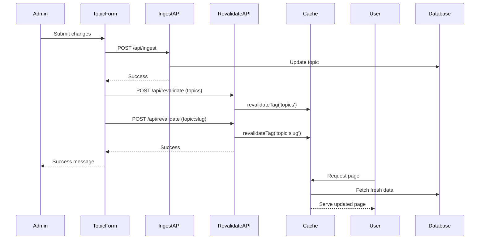

# Caching Strategy Documentation

## Overview

This document describes the comprehensive caching strategy implemented for the CMS frontend, including ISR (Incremental Static Regeneration), cache tagging, and on-demand revalidation.

**Requirements:** 10.1, 10.2, 10.7

## Caching Architecture

### 1. Next.js Cache Layers

The application uses multiple caching layers:

1. **Full Route Cache**: Static pages are cached at build time
2. **Data Cache**: API responses are cached with tags
3. **Request Memoization**: Deduplicates requests during rendering
4. **Router Cache**: Client-side navigation cache

### 2. ISR (Incremental Static Regeneration)

ISR allows pages to be regenerated in the background while serving stale content.

#### Configuration

```typescript
// Topic listing pages
fetch('/api/topics', {
  next: { 
    tags: ['topics'],
    revalidate: 300 // Revalidate every 5 minutes
  }
});

// Individual topic pages
fetch(`/api/topics/${slug}`, {
  next: { 
    tags: ['topics', `topic:${slug}`],
    revalidate: 300 // Revalidate every 5 minutes
  }
});
```

#### Benefits

- **Performance**: Serve cached pages instantly
- **Freshness**: Automatic background updates every 5 minutes
- **Scalability**: Reduces database load
- **SEO**: Fast page loads improve search rankings

### 3. Cache Tags

Cache tags enable granular cache invalidation.

#### Tag Structure

| Tag Pattern | Description | Used By |
|------------|-------------|---------|
| `topics` | All topics list | Topics listing page, homepage |
| `topic:{slug}` | Specific topic | Individual topic page |

#### Tag Usage

```typescript
// Revalidate all topics
await revalidateCache('topics');

// Revalidate specific topic
await revalidateCache('topic:my-topic-slug');

// Revalidate both (recommended after topic update)
await revalidateTopicCache('my-topic-slug');
```

### 4. On-Demand Revalidation

On-demand revalidation triggers immediate cache updates when content changes.

#### Revalidation Flow



#### Implementation

```typescript
// In admin pages after content update
await createOrUpdateTopic(payload);
await revalidateTopicCache(slug); // Revalidates both tags
```

### 5. Security

Revalidation endpoint is secured with:

- **API Key**: `x-api-key` header
- **Timestamp**: `x-timestamp` header (prevents replay attacks)
- **HMAC Signature**: `x-signature` header (verifies authenticity)

```typescript
// Signature generation
const message = `${timestamp}.${JSON.stringify(body)}`;
const signature = HMAC-SHA256(message, secret);
```

## Performance Metrics

### Target Metrics (Requirements: 10.7)

| Metric | Target | Current |
|--------|--------|---------|
| Lighthouse Performance | ≥ 90 | TBD |
| First Contentful Paint | < 1.5s | TBD |
| Time to Interactive | < 3.5s | TBD |
| Largest Contentful Paint | < 2.5s | TBD |
| Cumulative Layout Shift | < 0.1 | TBD |

### Cache Hit Rates

Monitor cache effectiveness:

```bash
# Check Next.js build output for cache statistics
npm run build

# Look for:
# ○ (Static)  automatically rendered as static HTML
# ● (SSG)     automatically generated as static HTML + JSON
# λ (Server)  server-side renders at runtime
```

## Testing Cache Behavior

### Manual Testing

1. **Test ISR**:
   ```bash
   # Build and start production server
   npm run build
   npm start
   
   # Visit a topic page
   # Wait 5+ minutes
   # Refresh - should see updated content if changed
   ```

2. **Test On-Demand Revalidation**:
   ```bash
   # Edit a topic in admin dashboard
   # Save changes
   # Immediately visit public topic page
   # Should see updated content
   ```

3. **Test Cache Tags**:
   ```bash
   # Use the test script
   node scripts/test-cache-revalidation.js
   ```

### Automated Testing

Run the cache verification script:

```bash
node scripts/verify-caching-strategy.js
```

## Best Practices

### 1. When to Revalidate

- ✅ **DO** revalidate after content updates
- ✅ **DO** revalidate both general and specific tags
- ✅ **DO** handle revalidation errors gracefully
- ❌ **DON'T** revalidate on every read operation
- ❌ **DON'T** block user operations on revalidation

### 2. Cache Tag Naming

- Use consistent patterns: `resource:identifier`
- Keep tags simple and predictable
- Document all tag patterns

### 3. Revalidation Timing

- **ISR interval**: 5 minutes (balance freshness vs. load)
- **On-demand**: Immediate after updates
- **Batch updates**: Consider debouncing multiple revalidations

### 4. Error Handling

```typescript
try {
  await revalidateTopicCache(slug);
} catch (error) {
  // Log but don't throw - cache revalidation failure 
  // shouldn't block the operation
  console.error('Cache revalidation failed:', error);
}
```

## Monitoring

### Key Metrics to Monitor

1. **Cache Hit Rate**: Percentage of requests served from cache
2. **Revalidation Frequency**: How often cache is invalidated
3. **Page Load Times**: Impact of caching on performance
4. **Error Rates**: Failed revalidation attempts

### Logging

```typescript
// Revalidation logs
console.log('Cache revalidated:', {
  tag: 'topic:my-slug',
  timestamp: new Date().toISOString(),
  success: true
});
```

## Troubleshooting

### Issue: Pages Not Updating

**Symptoms**: Content changes don't appear on public pages

**Solutions**:
1. Check revalidation is being called after updates
2. Verify API key and signature are correct
3. Check server logs for revalidation errors
4. Manually revalidate: `POST /api/revalidate`

### Issue: Slow Page Loads

**Symptoms**: Pages take too long to load

**Solutions**:
1. Check ISR is configured correctly
2. Verify cache tags are being used
3. Monitor database query performance
4. Consider reducing revalidation interval

### Issue: Stale Content

**Symptoms**: Old content persists too long

**Solutions**:
1. Reduce ISR revalidation interval
2. Ensure on-demand revalidation is working
3. Check cache tags are correct
4. Clear Next.js cache: `rm -rf .next/cache`

## Configuration Reference

### Environment Variables

```bash
# Required for revalidation
NEXT_PUBLIC_INGEST_API_KEY=your-api-key
NEXT_PUBLIC_INGEST_WEBHOOK_SECRET=your-webhook-secret
```

### Next.js Config

```javascript
// next.config.js
module.exports = {
  // Enable experimental features if needed
  experimental: {
    // Future caching improvements
  }
};
```

## Future Enhancements

1. **Redis Cache**: Add Redis for distributed caching
2. **CDN Integration**: Use CDN for static assets
3. **Cache Warming**: Pre-populate cache for popular pages
4. **Analytics**: Track cache performance metrics
5. **A/B Testing**: Test different cache strategies

## Related Documentation

- [Performance Optimization](./performance-optimization.md) - Overall performance strategy
- [Next.js Caching Documentation](https://nextjs.org/docs/app/building-your-application/caching)
- [ISR Documentation](https://nextjs.org/docs/app/building-your-application/data-fetching/fetching-caching-and-revalidating)
- [revalidateTag API](https://nextjs.org/docs/app/api-reference/functions/revalidateTag)
